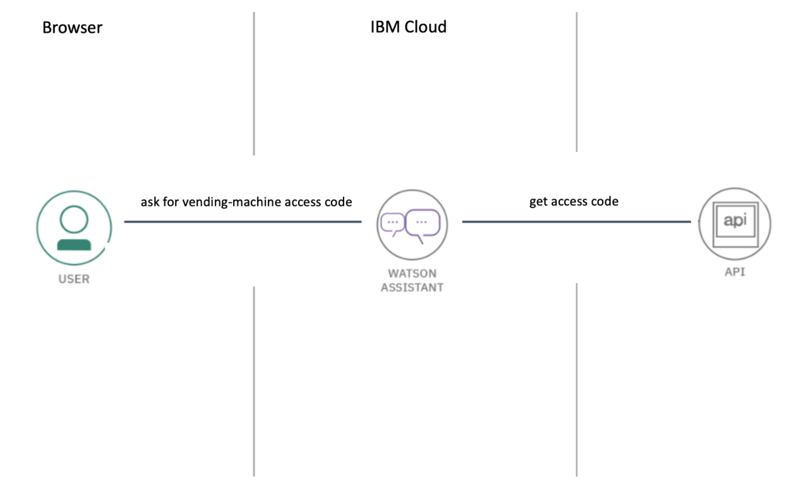

# Introducción

## Consigue tu código para la máquina expendedora

Bienvenidos!
En este workshop se muestran las instrucciones necesarias para utilizar IBM Watson Assistant Service en IBM Cloud con el fin de obtener tu código de acceso para la máquina expendedora y poder conseguir tu regalo ;-)

## Agenda

|  |  |
| :--- | :--- |
| [Lab 0: Pre-work](pre-work/README.md) | Pre-work para el proyecto |
| [Lab 1: Crea una instacia del servicio Watson Assitant](lab-1/README.md) | Creación del asistente |
| [Lab 2: Importa el dialog-skill](lab-2/README.md) | Configurar el chat-bot con sus nodos de diálogo |
| [Lab 3: Configura el diálogo para que el asistente funcione correctamente](lab-3/README.md) | Completar los diálogos del chatbot |
| [Lab 4: Inicia el chatbot y obtén tu código para la máquina expendedora](lab-4/README.md) | Pedir el código para la máquina expendedora |

## Arquitectura

El Bot que vas a configurar y usar está basado en la tecnología de Watson Assistant. El asistente recibirá tu solicitud de código y llamará a una función serverless, desplegada en IBM Functions. 
Configuraremos el chatbot para invocar a la función a través de una URL de webhook. 
La función, al ejecutarse, accede a una base de datos (Cloudant) que tenemos desplegada y que contiene los códigos a devolver. 
Puedes ver la arquitectura a continuación.

## Tiempo Estimado y nivel

Este workshop te llevará unos 30-40' y no necesitas conocimientos previos, sólo ganas de conocer y divertirte!

## Objetivos

Después de completar este workshop, serás capaz de:

* Crear una instancia de IBM Watson Assistant en IBM Cloud
* Agregar una habilidad de diálogo personalizada a IBM Watson Assistant
* Utilizar el chat-bot para obtener tu código de acceso a la máquina expendedora

## Compatibilidad

Estas instrucciones se han probado en la siguiente plataforma:

* **IBM Watson Assistant Service (Lite)** en IBM Cloud

## Autores

* [Luis Reyes](https://github.com/luisreyesoliva)
* [Jorge Mosquera](https://github.com)
* [Marcos Ortega](https://github.com/mosdso)
