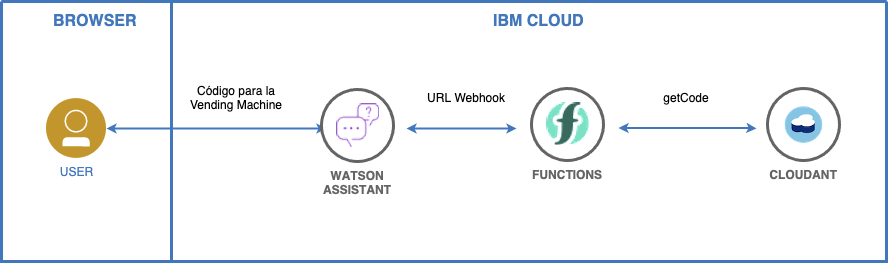

# Introducción

## Consigue tu código para la máquina expendedora

Bienvenidos! 
En este workshop se muestran las instrucciones necesarias para utilizar IBM Watson Assistant Service en IBM Cloud con el fin de obtener tu código de acceso para la máquina expendedora y poder conseguir tu regalo ;-)

### Sobre el workshop

La introducción al workshop está dividida en las siguientes secciones:

* [Agenda](./#agenda)
* [Arquitectura] (./arquitectura)
* [Tiempo Estimado y nivel](./#tiempo)
* [Objetivos](./#objetivos)
* [Compatibilidad](./#compatibility)
* [Creditos](./#credits)

## Agenda

|  |  |
| :--- | :--- |
| [Lab 0: Pre-work](pre-work/README.md) | Pre-work for the project |
| [Lab 1: Some Title](lab-1/README.md) | Exercise to do the thing |

## Arquitectura

Usamos IBM Watson Assistant y una API externa para obtener el código de acceso para la máquina expendedora, como se muestra en la imagen a continuación.

## Tiempo Estimado y nivel

|  |  |
| :--- | :--- |
| [Lab 0: Pre-work](pre-work/README.md) | Pre-work for the project |
| [Lab 1: Some Title](lab-1/README.md) | Exercise to do the thing |

## Objetivos

Después de completar este workshop, comprenderá los siguientes temas:
* Crear una instancia de IBM Watson Assistant en IBM Cloud
* Agregar una habilidad de diálogo personalizada a IBM Watson Assistant
* Utilizar un chat-bot para obtener tu código de acceso a la máquina expendedora
* Divertirte!

## Compatibilidad

Estas instrucciones se han probado en la siguiente plataforma:

* **IBM Watson Assistant Service (Lite)** en IBM Cloud

## Créditos

* [Luis Reyes Oliva]()
* [Jorge Mosquera]()
* [Marcos Ortega Sancho]()
