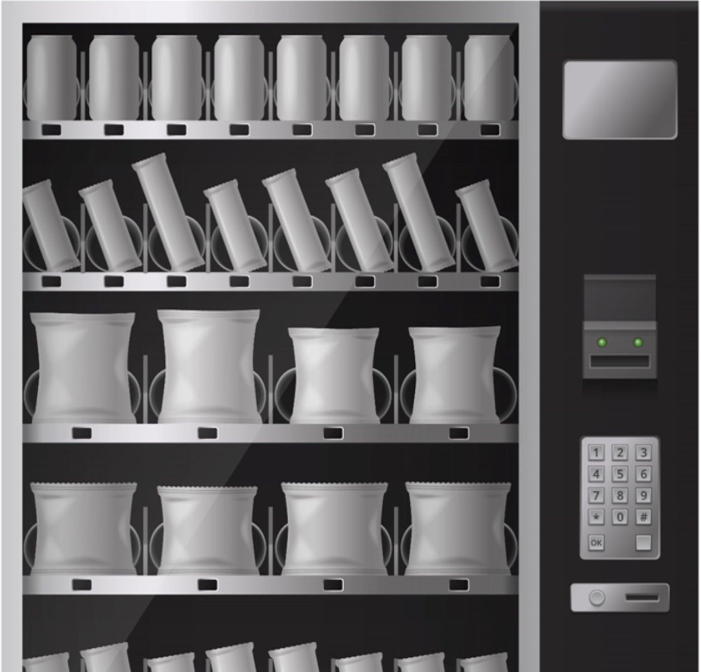

# Instrucciones: obtenga su codigo para la máquina expendedora

Bienvenidos! En este workshop se muestran las instrucciones necesarias para utilizar IBM Watson Assistant Service en IBM Cloud con el fin de que obtengan su código de acceso para la máquina expendedora.

## Arquitectura

Usamos IBM Watson Assistant y una API externa para obtener el código de acceso para la máquina expendedora, como se muestra en la imagen a continuación.

Tabla de contenidos:
* [Tiempo Estimado y nivel](#tiempo)
* [Objetivos](#objetivos)
* [Agenda](#agenda)
* [Compatibilidad](#compatibility)
* [Creditos](#credits)

## Tiempo Estimado y nivel

|  |  |
| :--- | :--- |
| [Lab 0: Pre-work](pre-work/README.md) | Pre-work for the project |
| [Lab 1: Some Title](lab-1/README.md) | Exercise to do the thing |

## Objetivos

Después de completar este workshop, comprenderá los siguientes temas:
* Crear una instancia de IBM Watson Assistant en IBM Cloud
* Agreguar una habilidad de diálogo personalizada a IBM Watson Assistant
* Utilizar un chat-bot para obtener su código de acceso a la máquina expendedora

## Agenda

Estas son las secciones del workshop, vaya realizandolas ordenadamente:

1. [Pre-work](pre-work/README.md)
2. [Crear una instancia de Watson Assistant Service en IBM Cloud](lab-1/README.md)
3. [Importar el dialog-skill](lab-2/README.md)
4. [Iniciar el chatbot y obtener el código para la maquina expendedora](#lab-3/README.md)

## Compatibilidad

Estas instrucciones se han probado en la siguiente plataforma:

* **IBM Watson Assistant Service (Lite)** en IBM Cloud

## Creditos

* [Luis Reyes Oliva]()
* [Jorge Mosquera]()
* [Marcos Ortega Sancho]()
