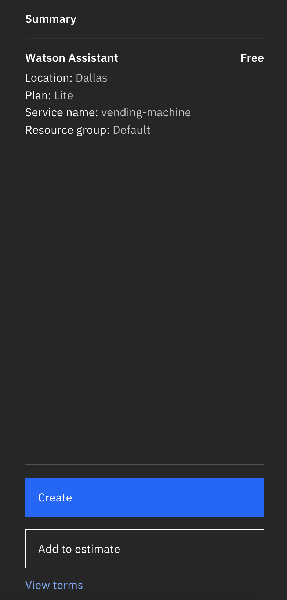
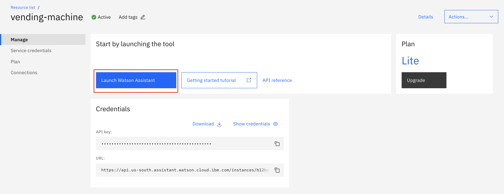
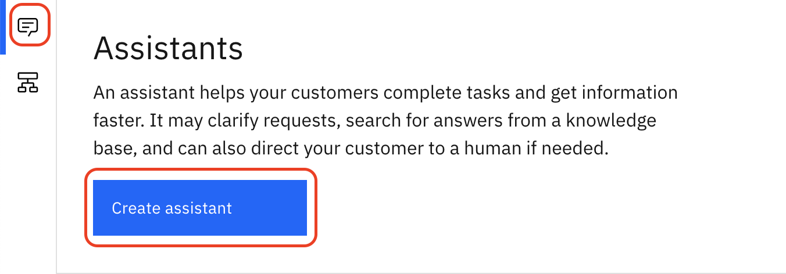
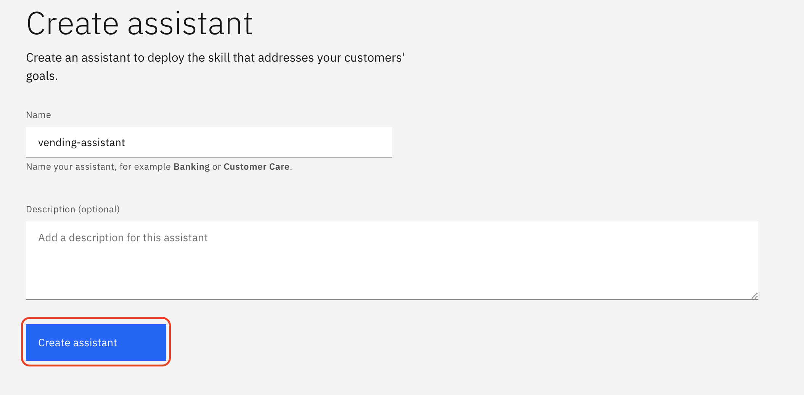

# Parte 1: Crear una instancia del servicio Watson Assistant Service en IBM Cloud

## Paso 1: Accede a la consola de IBM Cloud

Ve al siguiente enlace [https://cloud.ibm.com/login](https://cloud.ibm.com/login) y accede con tus credenciales.

## Paso 2: Abre el catálogo de servicios

Usa el siguiente link https://cloud.ibm.com/catalog/services/watson-assistant para acceder al servicio de Watson Assistant.

Una vez dentro, seleciona la opción "Lite" como se muestra en la siguiente figura:

## Paso 3: Modifica el nombre por defecto del servicio 

Cambia el nombre del servicio a "vending-machine", lo demás déjalo como está

## Paso 4: Crea el servicio 

Presiona Crear

## Paso 5: Lanza Watson Assitant 

Presiona Launch Watson Assistant

## Paso 6: Crea tu nuevo asistente virtual

Accede a asistentes y presiona Create Assistant

## Paso 7: Nombre al Asistente vending-assistant y presione Create assistant

