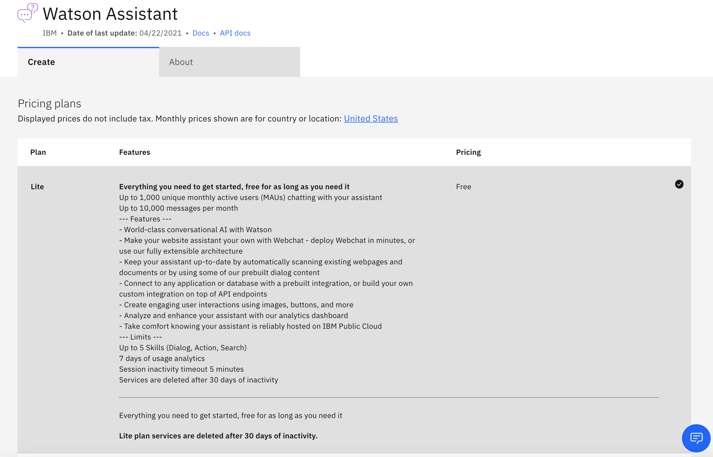
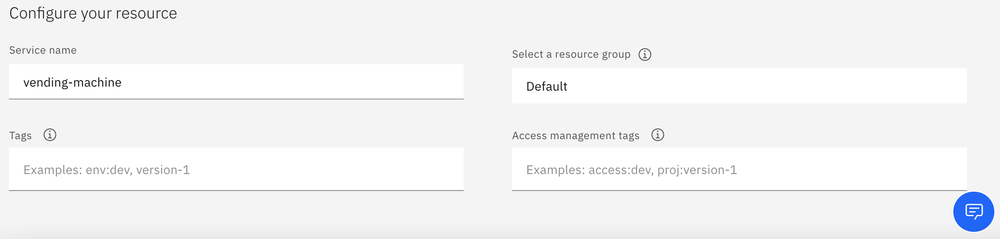

# Parte 1: Crear una instancia del servicio Watson Assistant Service en IBM Cloud

This section is comprised of the following steps:

1. [Paso 1](#1-step-1)
1. [Paso 2](#2-step-2)
1. [Paso 3](#3-step-3)
1. [Paso 4](#4-step-4)
1. [Paso 5](#5-step-5)
1. [Paso 6](#6-step-6)
1. [Paso 7](#7-step-7)
1. [Paso 8](#8step-8)
1. [Paso 9](#9-step-9)

## Paso 1: Hacer login en la consola de IBM Cloud

Vaya al siguiente enlace https://cloud.ibm.com/login y registrese con sus credenciales.

## Paso 2: Abra el catálogo de servicios

Use al siguiente link https://cloud.ibm.com/catalog/services/watson-assistant para acceder al servicio de Watson Assistant.

Una vez dentro selecione la opción Lite como se muestra en la siguiente figura:

## Paso 3: Cambie el nombre del servicio a vending-machine

## Paso 4: Pulse crear

## Paso 5: Presione Launch Watson Assistant

## Paso 6: Acceda a asistentes y presione Create assistant

## Paso 7: Nombre al Asistente vending-assistant y presione también Create assistant

