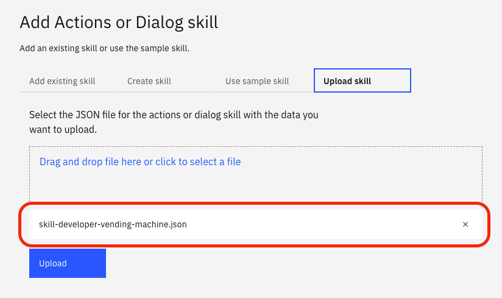
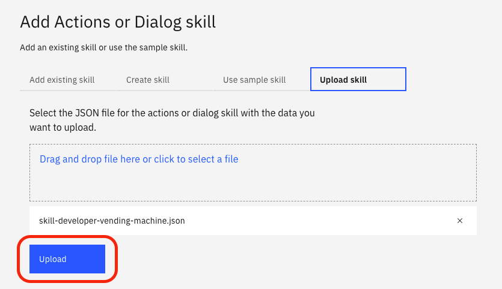

# Parte 2: Importar el dialog-skill

## Paso 1: Selecciona Add and action or dialog skill

## Paso 2: Selecciona Upload skill

## Paso 3: Abre el siguiente enlace en su navegador

## Paso 4: Selecciona Code, descarga el zip en Download ZIP y extrae los ficheros del zip en su ordenador

## Paso 5: Arrastre y suelte el archivo skill-developer-vending-machine-actual-version.json para la importación

## Paso 6: Presione Import

