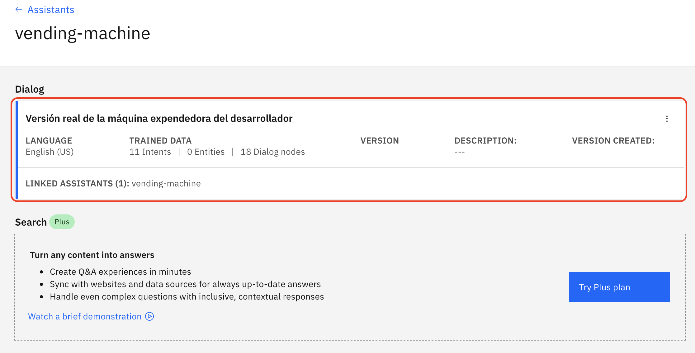
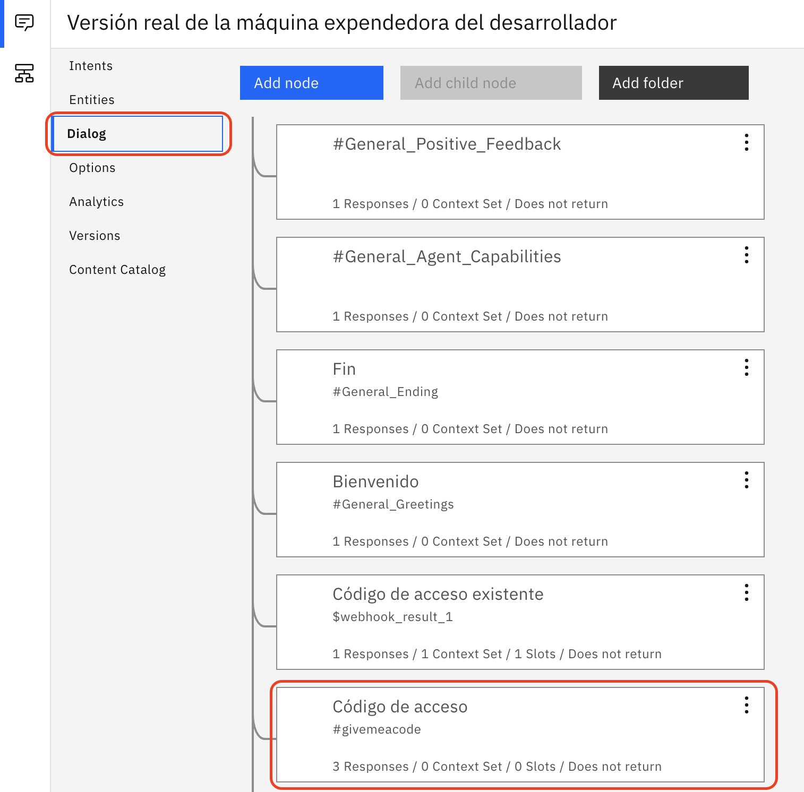
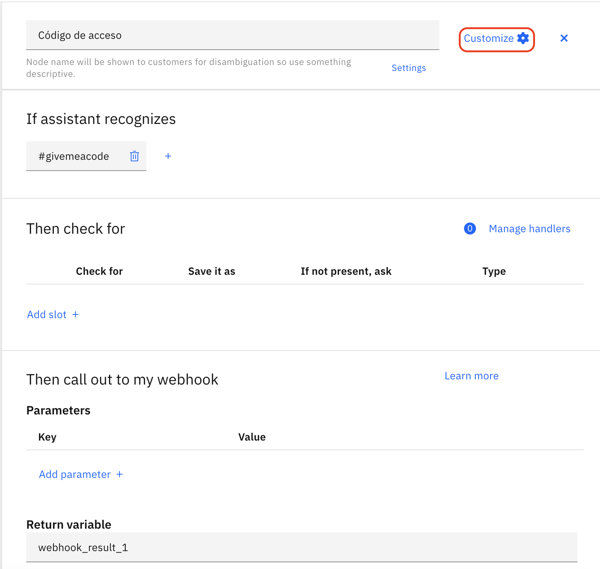
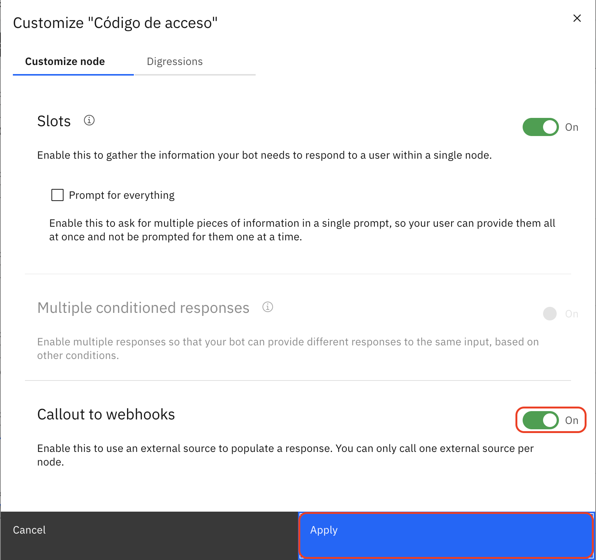
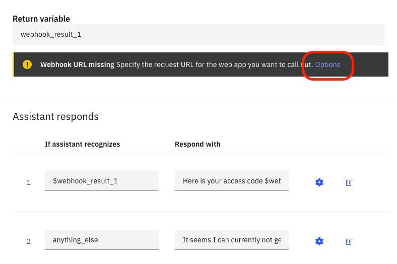
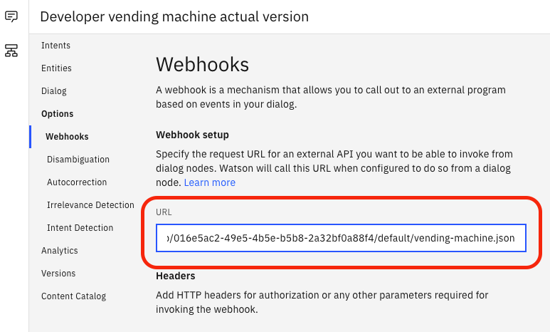

# Parte 3: Configurar el dialogo para que el asistente funcione correctamente

## Paso 1: Hacer click en el propio diálogo

Vas a entrar en la configuración del asistente virtual.

Observa que ya está preentrenado con 11 intenciones y 18 nodos de diálogo. Todo esto es lo que te has traido importando el skill en el lab anterior.

## Paso 2: Acceder a los nodos de dialogo y pinchar en el nodo llamado Código de acceso

Ahora vamos a acabar de configurar nuestro asistente para que funcione correctamente.

Busca entre los nodos de diálogo ya configurados, el que se llama "Código de acceso" y entra en su definición

## Paso 3: Acceder a Customize para revisar la configuración del nodo

## Paso 4: Una vez dentro, verifica que la opción de llamadas al webhoook está activada

Activando esta opción se va a permitir enviar peticiones HTTP POST a la URL del webhook que vamos a configurar a continuación.

## Paso 5: Configura el webhook para poder acceder a la función que devuelve los códigos

El nodo de diálogo está configurado para recoger en una variable el resultado de la invocación a la URL de webhook. Para configurarla, haz click en Options como se indica a continuación.

La siguiente URL corresponde a la URL pública de la función, la cuál va a leer de una base de datos Cloudant el código que devuelve el chat-bot cuando se solicita.

    https://eu-de.functions.appdomain.cloud/api/v1/web/016e5ac2-49e5-4b5e-b5b8-2a32bf0a88f4/default/vending-machine.json

Cópiala y pégala en el campo URL de la configuración del webhook.

