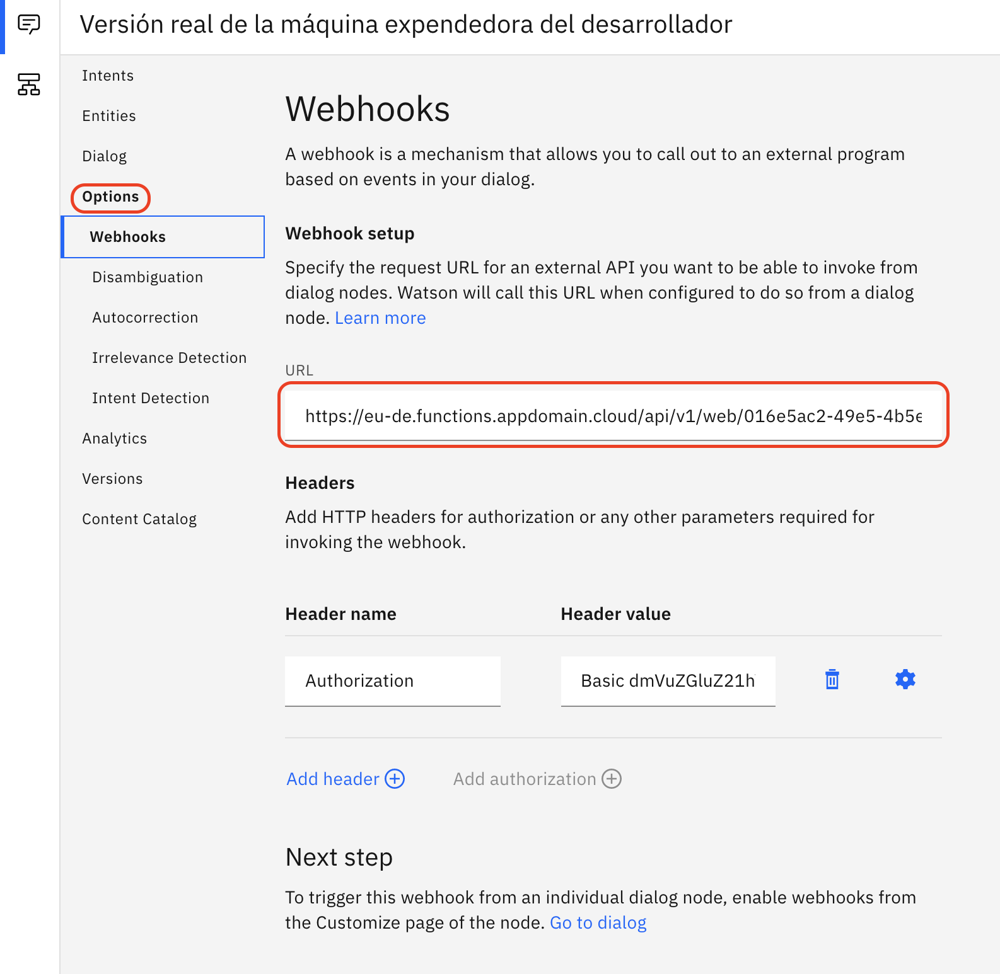

# Parte 3: Configurar el dialogo para que el asistente funcione correctamente

## Paso 1: Hacer click en el propio diálogo

## Paso 2: Acceder a los nodos de dialogo y pinchar en el nodo llamado Codigo de acceso

## Paso 3: Acceder a Customize para así activar las llamadas al webhoook

## Paso 4: Una vez dentro, activar las llamadas al webhoook y aplicar los cambios

Activando esta opción se va a permitir enviar peticiones HTTP POST a la URL del webhook que se define en la parte de opciones. Esta URL corresponde a la URL pública de la función, la cuál va a leer de una base de datos Cloudant el código que devuelve el chat-bot cuando se solicita.

