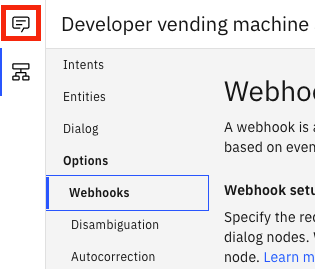
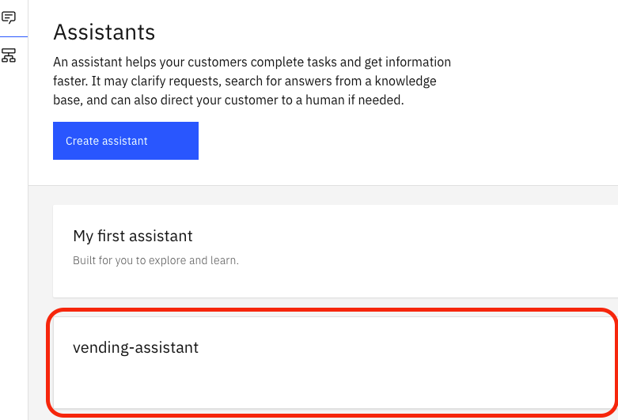
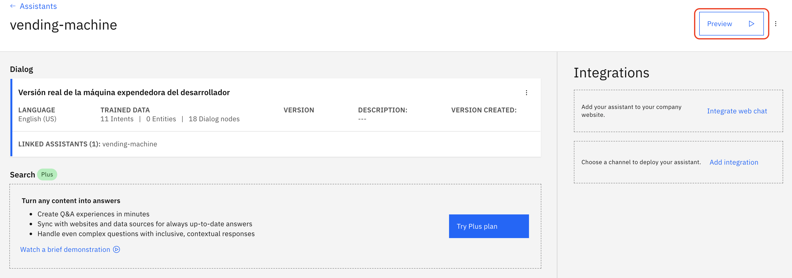
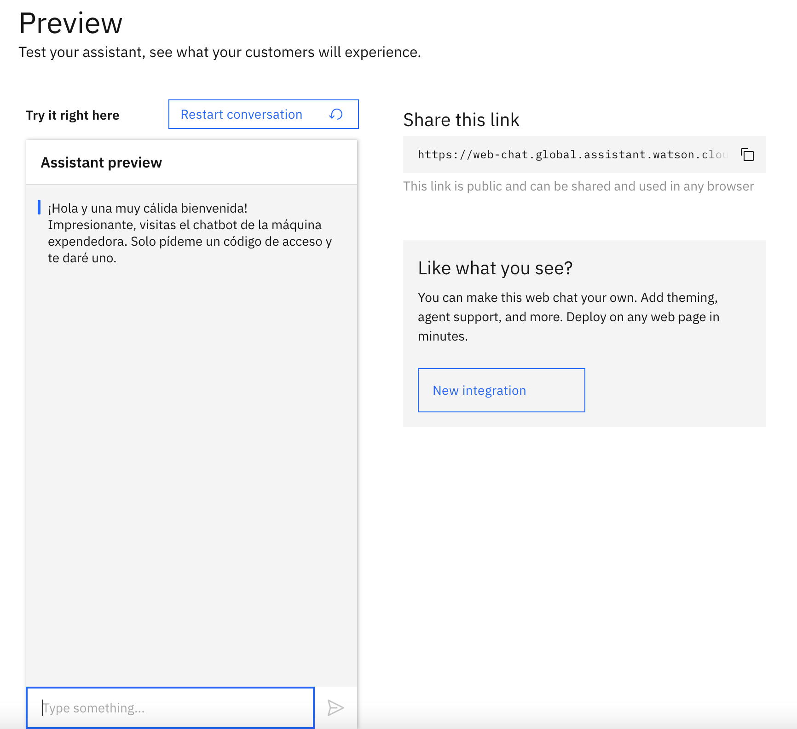
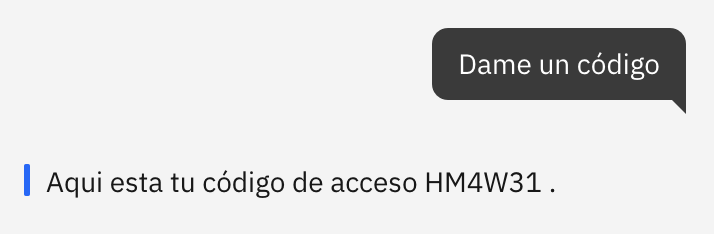

# Parte 4: Inicia el chatbot y obtén el código para la vending-machine

## Paso 1: Vuelve al asistente y haz click en Preview

Vuelve al menú y haz click en el icono de asistentes

Ahora selecciona el asistente que creaste anteriormente

Haz click en Preview para lanzar el chatbot

## Paso 2: Ahora ya puedes utilizar el asistente

## Paso 3: Solicita tu código para la vending-machine

## Paso 4: ¡Enhorabuena! ¡Has finalizado el workshop

Ya puedes usar tu código para canjearlo en la máquina de vending.
Accede ya a la [vending-machine-ibm](http://vendingmachineibm.com/) para elegir tu regalo.

¡Que lo disfrutes!
