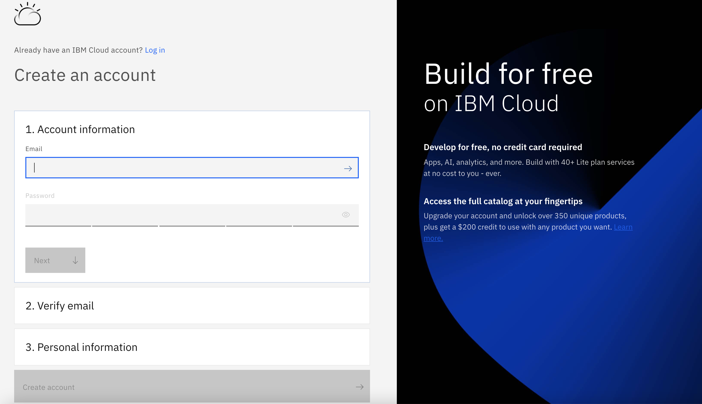
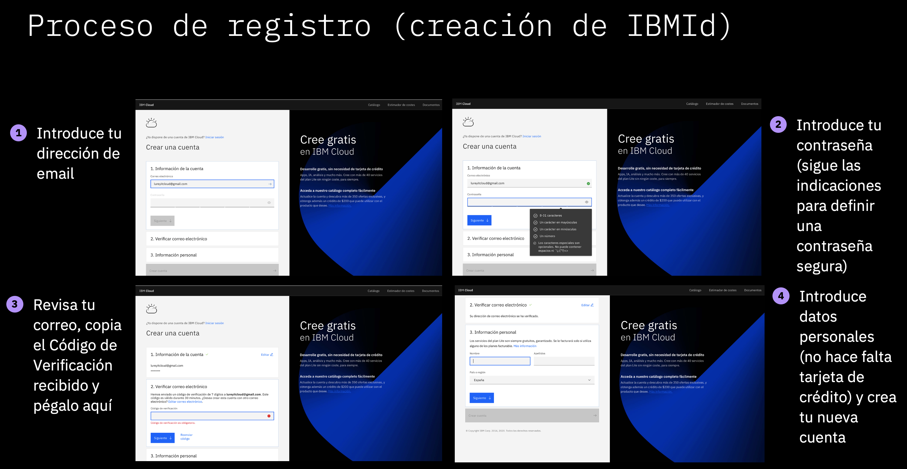

# Pre-work

## Paso 1: Registrarse en IBM CLoud

Accede a la [página de Registro](http://ibm.biz/code-zone) para crear tu cuenta en IBM Cloud.

## Paso 2: Complete el formulario de registro y vaya a su correo electrónico para realizar la **confirmación** de su cuenta

Sigue estos sencillos pasos para registrarte

